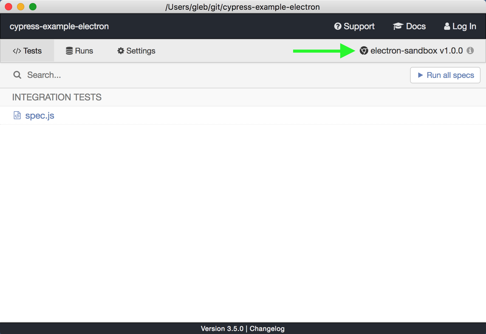
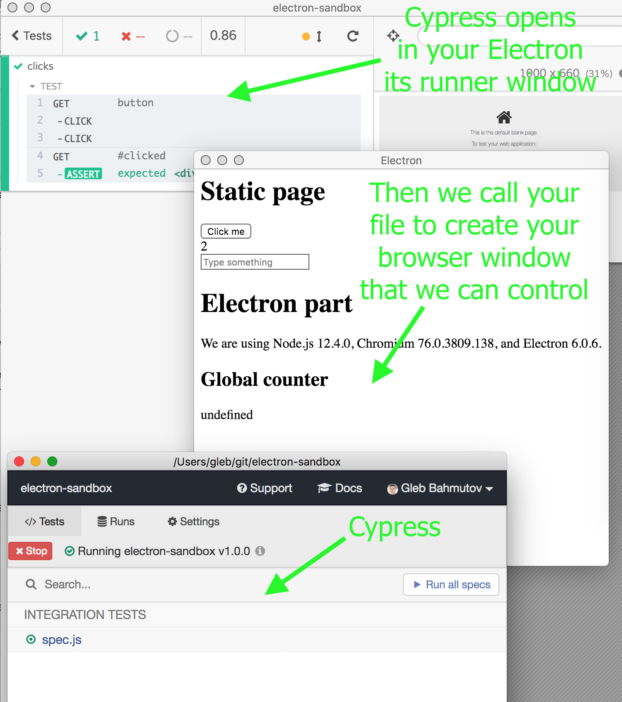

# @cypress/electron-plugin
> Cypress plugin for testing Electron applications

See example project [cypress-example-electron](https://github.com/cypress-io/cypress-example-electron)

## Restrictions

Currently we only do `window.loadURL` from tests.

## Installation

⚠️ This plugin and Cypress Test Runner are highly experimental alpha previews. Thus the instructions to install and use this plugin are complicated. In the future we expect it to be as simple as installing any other Cypress plugin:

```shell
npm i -D cypress @cypress/electron-plugin
```

Follow issue [#4964](https://github.com/cypress-io/cypress/issues/4964) for official progress.

### Install Cypress pre-release

Currently though you need to install a [Cypress pre-release](https://on.cypress.io/installing-cypress#Install-pre-release-version) from branch [test-electron-app-4964](https://github.com/cypress-io/cypress/commits/test-electron-app-4964). On that branch, pick a commit, like [05caf3](https://github.com/cypress-io/cypress/commit/05caf31764a934d1446b46ae62b23dacfaef6afc), and if a Cypress binary has been built (we don't build beta releases on that branch for all platforms), then there should be a comment with installation instructions, like [this one](https://github.com/cypress-io/cypress/commit/05caf31764a934d1446b46ae62b23dacfaef6afc#commitcomment-35076452).


I am using Mac so architecture `darwin x64` is what I need; and to install the new version I need both the environment variable `CYPRESS_INSTALL_BINARY` and the matching NPM module url.

For example, I will install Electron plugin

```shell
export CYPRESS_INSTALL_BINARY=https://cdn.cypress.io/beta/binary/3.5.0/darwin-x64/circle-test-electron-app-4964-05caf31764a934d1446b46ae62b23dacfaef6afc-151612/cypress.zip
npm install -D https://cdn.cypress.io/beta/npm/3.5.0/circle-test-electron-app-4964-05caf31764a934d1446b46ae62b23dacfaef6afc-151611/cypress.tgz
```

**Tip:** Cypress might think that you have already installed v3.5.0 and will refuse to install the new commit SHA again. Find the path to the Cypress cache folder and remove the version subfolder and install again.

```shell
$ npx cypress cache path
/Users/gleb/Library/Caches/Cypress
$ rm -rf /Users/gleb/Library/Caches/Cypress/3.5.0/
```

Or you can first install Cypress NPM module with `npm i <cypress npm url>` and then call

```shell
export CYPRESS_INSTALL_BINARY=...
$ npx cypress install -f
```

**Warning:** you probably will see the full NPM url of Cypress beta release in `package.json`.

```json
{
  "devDependencies": {
    "cypress": "https://cdn.cypress.io/beta/npm/3.5.0/circle-test-electron-app-4964-05caf31764a934d1446b46ae62b23dacfaef6afc-151611/cypress.tgz",
  }
}
```

Note that this will only work if you have previous installed beta release binary, or set `export CYPRESS_INSTALL_BINARY=` variable before running `npm i` in the future.

### Install this plugin

```shell
$ npm i -D @cypress/electron-plugin
+ @cypress/electron-plugin@1.1.0
```

Add new custom command to `cypress/support/index.js`  file

```js
import '@cypress/electron-plugin/support'
```

This plugin provides new custom commands to interact with your application, like `cy.electronVisitUrl`.

### Use your Electron to run tests

Your project uses Electron to load and run your `main.js` file. Install it

```shell
$ npm i -D electron
+ electron@6.0.9
```

You need to tell Cypress about this Electron and remove any normal browsers from the Cypress browsers list - you cannot run Electron tests in a "normal" Chrome for example. You can modify the run-time list of browsers using `cypress/plugins/index.js` file.

```js
const path = require('path')
const pkg = require('../../package')

const pathToElectron = path.join(
  __dirname,
  '..',
  '..',
  'node_modules',
  '.bin',
  'electron'
)
module.exports = (on, config) => {
  // remove "standard" browsers and use
  // our local Electron as a browser
  config.browsers = [
    {
      name: 'electron-sandbox',
      family: 'electron-app',
      displayName: 'electron-sandbox',
      version: pkg.version,
      path: pathToElectron,
      // show full package version in the browser dropdown
      majorVersion: `v${pkg.version}`,
      info:
        pkg.description || 'Electron.js app that supports the Cypress launcher'
    }
  ]

  return config
}
```

When you start Cypress you should just see the Electron in the list of browsers.



## Refactor your application

We need to be able to recreate the main browser window on demand during tests, probably even before each test. To achieve this, your application should separate application start from creating the main window.

A typical Electron application starts running the `main.js` script file. Usually that file creates the browser window. To make it testable, move browser creation into a separate file, let's call it `main_browser_window.js`. That file should export just a single function that would create the window when called.

```js
// main_browser_window.js
const _ = require('lodash')
const { BrowserWindow } = require('electron')
module.exports = (options = {}) => {
  _.defaultsDeep(options, {
    width: 200,
    height: 200,
    webPreferences: {
      nodeIntegration: true
    }
  })
  let win = new BrowserWindow(options)
  // attach any other event handlers as usual
  return win
}
```

From `main.js` we import the window factory function and call once. This is the normal application flow.

```js
// main.js
const { app } = require('electron')
const MainBrowserWindow = require('./main_browser_window')
let win
function createWindow () {
  // Create the browser window.
  win = MainBrowserWindow()
  win.loadURL('http://someurl')
}
app.on('ready', createWindow)
```

## Writing tests

Example test should tell Cypress the path to the main browser window factory file, and the url to load.

```js
// cypress/integration/spec.js
it('clicks', () => {
  // window creation and url load
  cy.electronVisitUrl('./main_browser_window.js', 'http://localhost:4600')
  cy.get('button')
    .click()
    .click()
  cy.get('#clicked').should('have.text', '2')
})
```

When Cypress opens the local Electron app, instead of YOUR `main.js` it loads `@cypress/electron-plugin` file. This file creates the initial runner UI and starts running tests. Then `cy.electronVisitUrl` is called and Cypress creates new Electron browser window using YOUR window factory function. Cypress can still control your window and see everything that happens inside its web contents. In a picture the flow looks like this:



## Debugging

You can try running Cypress with `DEBUG` environment set, for example

```shell
DEBUG=cypress:launcher npx cypress open
```

To see ALL Cypress messages

```shell
DEBUG=cypress:* npx cypress open
```

## License

This project is licensed under the terms of the [MIT license](/LICENSE.md).
