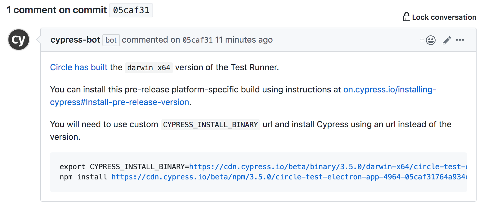

# @cypress/electron-plugin
> Cypress plugin for testing Electron applications

## Installation

⚠️ This plugin and Cypress Test Runner are highly experimental alpha previews. Thus the instructions to install and use this plugin are complicated. In the future we expect it to be as simple as installing any other Cypress plugin:

```shell
npm i -D cypress @cypress/electron-plugin
```

Currently though you need to install a [Cypress beta build](https://on.cypress.io/installing-cypress#Install-pre-release-version) from branch [test-electron-app-4964](https://github.com/cypress-io/cypress/commits/test-electron-app-4964). On that branch, pick a commit, like [05caf3](https://github.com/cypress-io/cypress/commit/05caf31764a934d1446b46ae62b23dacfaef6afc), and if a Cypress binary has been built (we don't build beta releases on that branch for all platforms), then there should be a comment with installation instructions, like [this one](https://github.com/cypress-io/cypress/commit/05caf31764a934d1446b46ae62b23dacfaef6afc#commitcomment-35076452).



I am using Mac so architecture `darwin x64` is what I need.

## License

This project is licensed under the terms of the [MIT license](/LICENSE.md).
